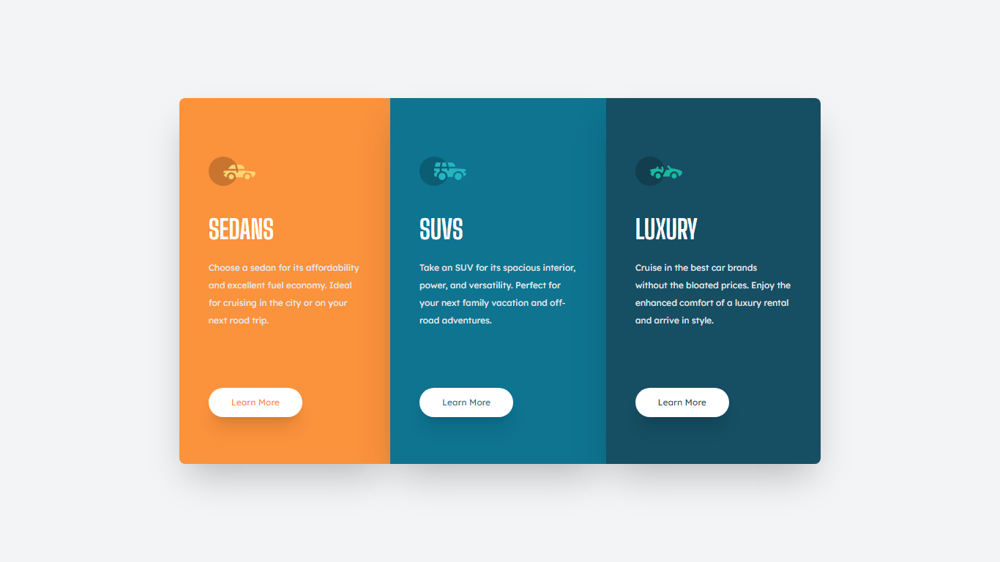

<h1>3-column preview card component solution</h1>

This is my solution to the [3-column preview card component challenge on Frontend Mentor](https://www.frontendmentor.io/challenges/3column-preview-card-component-pH92eAR2-). 

</img>

- Solution URL: [Frontend Mentor](https://www.frontendmentor.io/solutions/3-column-preview-card-component-GdeNKzBcw3)
- Live Site URL: [GitHub](https://kalebemax.github.io/3-column-preview-card-component-main/)

<h2>Built with</h2>

- Semantic HTML5 markup
- CSS custom properties
- Tailwind Css
- Flexbox
- VS Code
- Google Fonts
- Git
- Mobile-first workflow
